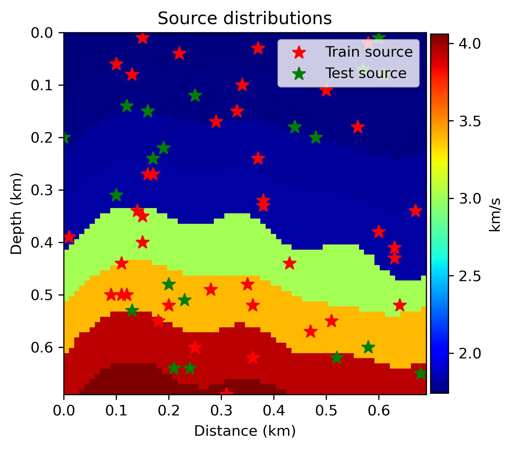
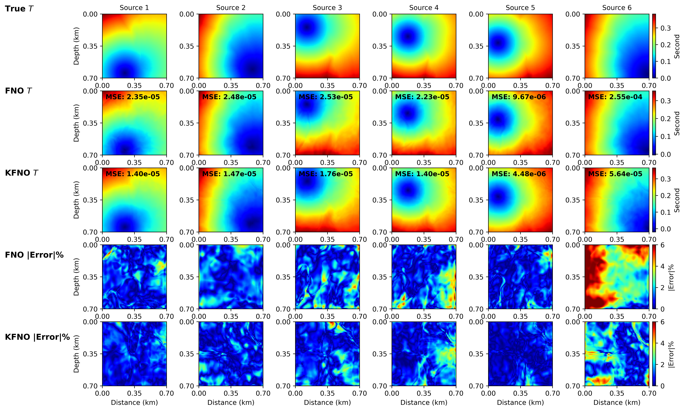
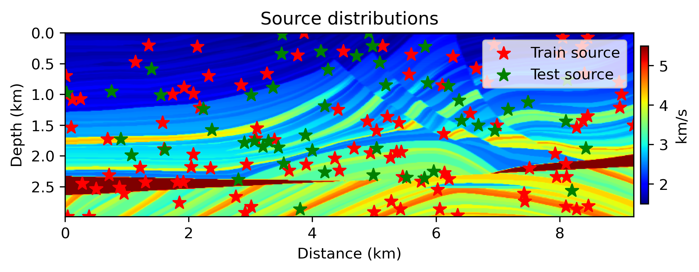
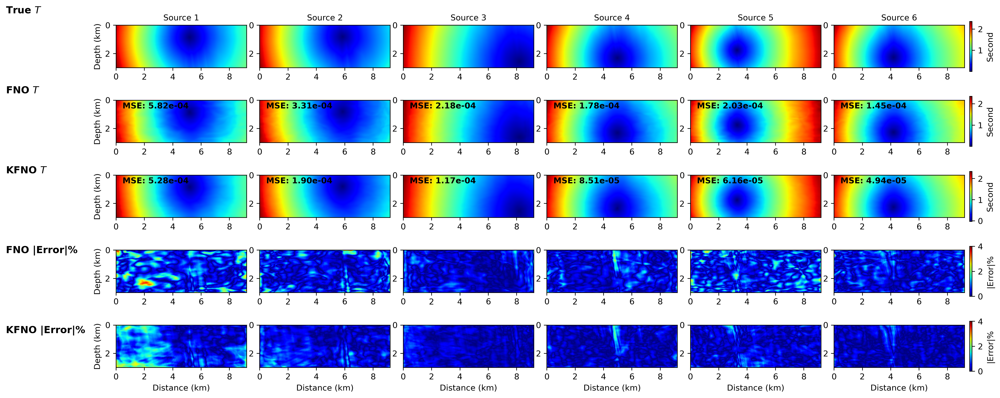

# KAGN-FNO-Eikonal_Equation
Leveraging Kolmogorov-Arnold Network Empowered Fourier Neural Operator to Solve Eikonal Equations

This is an exmaple of using KFNO to sovle travel time equation. The velocity model is extracted from OpenFWI (CurveVel-A Family). 

## Network
Seismic traveltime is a fundamental tool for exploring the Earth's interior structure and properties, and it is widely used within the seismology community. Conventional methods, such as the fast sweeping method and the fast marching approach, are effective for calculating traveltimes from a single source. However, they become computationally expensive when applied to multiple sources. To address this limitation, we propose a novel network that integrates the Kolmogorov-Arnold Network with the Fourier Neural Operator (FNO), namely KFNO. This proposed KFNO leverages the strengths of both KAN and FNO. Unlike vanilla FNO, KFNO utilizes a convolutional KAN layer in the Fourier block, which adaptively learns the activation function during the training process, resulting in a more robust Eiknoal solver. To evaluate the simulation accuracy, we conducted numerical experiments using two well-known realistic velocity models: the OpenFWI and Marmousi datasets. The simulation results demonstrate that KFNO achieves higher accuracy than vanilla FNO in terms of mean square error (MSE). 

## Reuslts
  - **OpenFWI velocity model**
    1) Sources distribution of training and testing datasets

    2) Prediction comparison using different methods on different sources

  - **Marmousi velocity model**
    1) Sources distribution of training and testing datasets

    2) Prediction comparison using different methods on different sources

## Reference
    Yang Cui, Umair Bin Waheed, Chao Song, and Yangkang Chen (2025). KFNOEikonal: Integrating Kolmogorov-Arnold Network with Fourier Neural Operator for Seismic Traveltime Computation. TBD.
    Cui, Yang, Umair Bin Waheed, Chao SOng, and Yangkang Chen. "Leveraging Kolmogorov-Arnold Network Empowered Fourier Neural Operator to Solve Eikonal Equation." SEG International Exposition and Annual Meeting. SEG, 2025.

BibTex

    @article{cui2025KFNOEikonal,
      title={KFNOEikonal: Integrating Kolmogorov-Arnold Network with Fourier Neural Operator for Seismic Traveltime Computation},
      author={Cui, Yang and Waheed, Umair Bin and Chao, Song and Chen, Yangkang},
      journal={TBD},
      year={2025},
      publisher={TBD}
    }
    @inproceedings{cui2024kfno,
      title={Leveraging Kolmogorov-Arnold Network Empowered Fourier Neural Operator to Solve Eikonal Equation},
      author={Cui, Yang and Waheed, Umair Bin and Song, Chao and Chen, Yangkang},
      booktitle={SEG International Exposition and Annual Meeting},
      pages={SEG--2025},
      year={2025},
      organization={SEG}
    }

## Install 
For set up the environment and install the dependency packages, please run the following script:
    
    conda create -n KFNOEikonal python=3.11.7
    conda activate KFNOEikonal
    conda install ipython notebook
    pip install torch==2.5.1, pyekfmm

## Development

    The development team welcomes voluntary contributions from any open-source enthusiast. 
    If you want to make contribution to this project, feel free to contact the development team. 
    
## Contact

    Regarding any questions, bugs, developments, collaborations, please contact  
    Yang Cui
    yang.cui512@gmail.com
